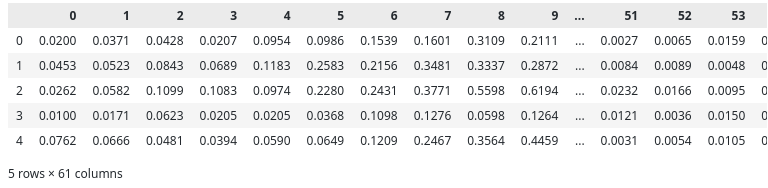

# Binary Classification Model in PyTorch, with A +

This is a notebook I've created to practice building neural networks in PyTorch. It is based on the post 'Building a Binary Classification Model in PyTorch' by Adrian Tam (Machine Learning Mastery, [source](https://machinelearningmastery.com/building-a-binary-classification-model-in-pytorch)), but I've added detailed information about the dataset and added more details on how to design a feedforward neural network (FNN) in PyTorch. I also explore the data by experimenting with different feature selection and visualization techniques. Thus, I have included some valuable content that might be useful for you as well. After choosing between a wide (but shallow) neural network and a deep neural network, I search for the best hyperparameters and regularization techniques to enhance the model. Additionally, I compare the FNN model with more traditional statistical learning approaches such as Support Vector Machine for Classification (SVC).

**Steps**
1. About the dataset
2. Loading the training data
3. Performing an Exploratory Data Analysis (EDA)
4. Making the data available to PyTorch
5. Designing Feedforward Neural Network (FNN) models
6. Defining the FNN training loop
7. Training and evaluating model's performance with k-fold cross-validation
8. Running the model in inference mode
9. Creating a Receiver Operating Characteristics (ROC) curve for binary classification
10. Comparing neural networks and SVM classifier


## About the dataset

The data serves as the cornerstone for any data scientist. A profound understanding of it is the pivotal first step in crafting a model that accurately predicts labels or continuous values. While learning algorithms handle numbers, data scientists go deeper into the narrative behind the data. Whether you're a job-seeking machine learning practitioner or a small-medium company aiming to boost profits, the key lies in comprehending the data's story.

In this analysis, we analyze the [sonar dataset](https://archive.ics.uci.edu/dataset/151/connectionist+bench+sonar+mines+vs+rocks), a collection of 208 bouncing sonar signals represented by 60 numerical variables. These signals, obtained by impinging pulses on a metal cylinder and a rock, aim to discriminate between Metal (M) and rock (R) in a binary classification task. The dataset presents a slightly imbalanced distribution: 111 samples from a metal cylinder and 97 samples from a cylindrically shaped rock. The detailed process of data collection and more insights about the dataset are available in the link's webpage and the article by [Gorman et al., 1988](https://doi.org/10.1016/0893-6080(88)90023-8). Notably, the sonar dataset serves as a standard benchmark, achieving an approximate accuracy of 85% using a feedforward neural network (FNN) for classification.

<figure>
  <p align="center">
    
  </p>
</figure>


<font color="grey"> **Figure 1.** The preprocessing of the bouncing sonar signals produces a sampled spectral envelope normalized to vary from 0.0 to 1.0 for input to the network. (a) The set of sampling apertures offset temporally to correspond to the slope of the FM chirp, (b) sampling apertures superimposed over the 2D display of the short-term Fourier transform, (c) the spectral envelope obtained by integrating over each sampling aperture (Source: Figure 3, Gorman, R.Paul, and Terrence J. Sejnowski. “Analysis of Hidden Units in a Layered Network Trained to Classify Sonar Targets.” Neural Networks 1, no. 1 (January 1988): 75–89).</font> 


## Loading training data

First we load the raw data into a Pandas DataFrame, a convenient format for subsequent exploratory data analysis (EDA) and data preprocessing:

```python
import pandas as pd

df = pd.read_csv("./sonar.csv", header=None)
```

Let's check the number of samples and features we have on hads for the task. 

```python
df.head()
```
<figure>
  <p align="center">
    
  </p>
</figure>

## Performing an Exploratory Data Analysis (EDA)

Building a accurate machine learning model heavily relies on quality of the data fed into it for training and testing. Analyzing how the data is distributed and how relevant they are for predicting the outcome is an essential part of designing an accurate model. An EDA is crucial because enables:

1. Feature selection: emcompasses a set of techniques to filter out those features that contain little information for the model. We seek for those features that has high variance but excluding the features that are highly correlated, thus redundant for training the model.
2. Feature engineering: understanding the data enables us to combine features to imporove model's performance.
3. Normalization and Standardization: most machine learning algorithms are sensitive to the scaling of the data, requiring normalization (scaling the data to a defined range) or standardization (shifting the distribution to mean = 0 and standard deviation = 1). Both approaches ensures that the model learning isn't dominated by features with high values compared to others (for example: the price and the total area of a house when prediction selling prices).
4. Outlier detection: Plotting the mean and variance of the dataset reveal outlier values, which could be detrimental for the model during the training process. In the end, machine learning algorithms are there to learn the distribution of the data in order to predict new values.

We do not expect that all features in a real-world dataset will be important for predicting the outcome, and we can use some dimensionality reduction and feature selection  A lighter dataset will result in a simpler and more powerfull model, with greater generalization capability when seeing new data.

To get some initial descriptive statistics of the dataset, the DataFrame method ``DataFrame.describe()`` shows the data central tendency, dispersion and quartile information. We also plot the distribution of the data to get insights:

```python
df.describe()
```

<figure>
  <p align="center">
    
  </p>
</figure>

```python
import matplotlib.pyplot as plt
import seaborn as sns

feat_var = df.var(numeric_only=True, skipna=True)
feat_mean = df.mean(numeric_only=True, skipna=True)

disp = sns.lineplot(data=feat_mean, color="g", legend="brief", label="Mean")
disp = sns.lineplot(data=feat_var, color="r", legend="brief", label="Variance")
disp.set_xlabel("Features")
sns.despine()  # remove top and right spines

plt.show()
```

<figure>
  <p align="center">
    
  </p>
</figure>

We should also assess whether the dataset is balanced. Imbalanced datasets, characterized by a high prevalence of one or more labels, are detrimental for model training, as they can introduce bias toward the majority label.

```python
plt.figure(figsize=(3, 4))
sns.countplot(x="Label", data=df).set_title("Label distribution")
sns.despine()
plt.show()
```

<figure>
  <p align="center">
    
  </p>
</figure>

The dataset is fairly balanced, thus we can skip the process of balancing the dataset. There are several techniques available for balacing datasets, but we will aproach such methods in a future post.

We can also take a look at some density estimates of the variables. Instead of using an histogram to approximate the probability density function, we will use kernel density estimation (KDE) that "smooths" the histogram of data with limited number of samples by summing up kernels placed in each data point. In this context, kernel is a smooth symmetric function.

```python
# creating subplots
fig, axs = plt.subplots(10, 6, figsize=(15, 15))
plt.subplots_adjust(hspace=0.7, wspace=0.3)
plt.suptitle("Feature Kernel Density Distribution", fontsize=18)
sns.despine()

# iterating through dataset to plot in axes
for feat, ax in zip(df.columns, axs.ravel()):
    sns.kdeplot(data=df[feat], fill=True, ax=ax, color="royalblue")
plt.show()
```

<figure>
  <p align="center">
    
  </p>
</figure>

